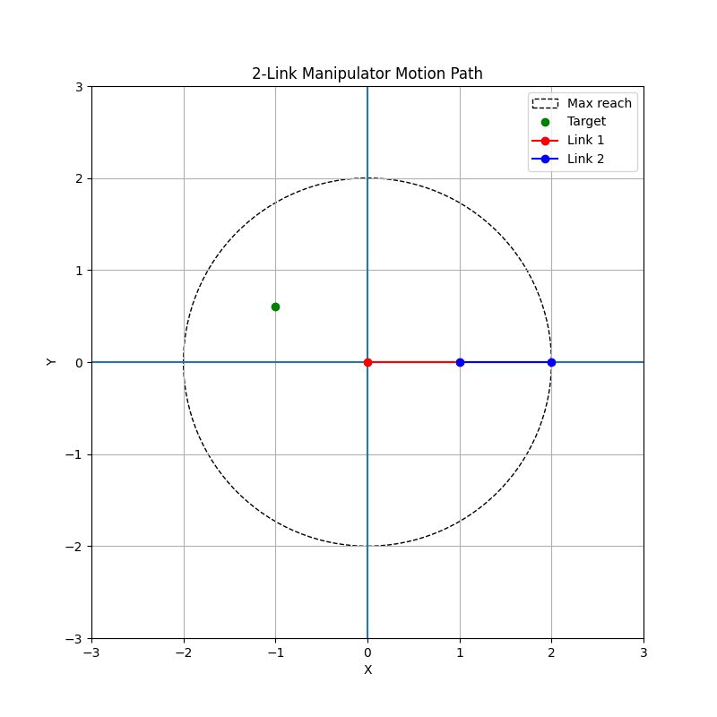

# 2D Manipulator Simulator

A Python project for simulating a 2-link planar robotic manipulator.
Built as a learning project covering kinematics, motion planning, OOP, and visualization.



---

## Features

- **Forward kinematics** — calculates joint and end-effector positions from link lengths and angles
- **Inverse kinematics** — calculates joint angles for a given target point, with elbow up/down modes
- **Reachability check** — detects whether a target point is within the manipulator's workspace
- **Workspace visualization** — shows the reachable area as min/max radius circles
- **Motion path generation** — interpolates joint angles between start and target positions
- **Animation** — frame-by-frame animation of the manipulator moving to a target point
- **GIF export** — saves the animation as a GIF file
- **OOP design** — `TwoLinkManipulator` class encapsulates state and behavior

---

## Project structure

```text
2d-manipulator-simulator/
├─ src/
│  └─ manipulator/
│     ├─ config.py              # Link lengths and default angles
│     ├─ math_utils.py          # Math helpers: projection, distance, reachability
│     ├─ forward_kinematics.py  # FK: joint positions from angles
│     ├─ inverse_kinematics.py  # IK: angles from target point
│     ├─ motion.py              # Motion path generation
│     ├─ robot.py               # TwoLinkManipulator class
│     ├─ visualizer.py          # Matplotlib visualization and animation
│     ├─ printer.py             # Console output
│     ├─ main.py                # Demo: default manipulator position
│     ├─ main_reverse.py        # Demo: move to user-defined target point
│     └─ playground.py          # Sandbox for experiments
├─ tests/
│  ├─ test_forward_kinematics.py
│  ├─ test_inverse_kinematics.py
│  └─ test_motion.py
├─ requirements.txt
├─ .gitignore
└─ README.md
```

---

## How to run

**Requirements:** Python 3.10+, matplotlib, Pillow

Install dependencies:
```bash
pip install -r requirements.txt
```

**Forward kinematics demo** — shows the manipulator in its default position:
```bash
cd src
python -m manipulator.main
```

**Inverse kinematics demo** — enter a target point and watch the manipulator animate to it:
```bash
cd src
python -m manipulator.main_reverse
```

You will be prompted to enter:
- Target x and y coordinates
- Elbow mode: `up` or `down` (default: `up`)

A GIF of the animation will be saved as `manipulator.gif`.

---

## Example
Enter target x: 1
Enter target y: 1
Choose elbow mode [up/down] (default: up):
Angle 1: 45.0 degrees
Angle 2: -90.0 degrees
IK check: OK

---

## Roadmap

- [x] Forward kinematics
- [x] Inverse kinematics with elbow up/down
- [x] Workspace visualization
- [x] Motion path generation
- [x] Frame-by-frame animation
- [x] GIF export
- [x] OOP refactor — TwoLinkManipulator class
- [ ] FuncAnimation polish
- [ ] GUI / pygame visualization
- [ ] Computer vision target detection
- [ ] Physical manipulator integration

---

## About

This project was built to learn Python through a real engineering problem.
The goal is to gradually evolve it from a math simulator into an applied robotics system.